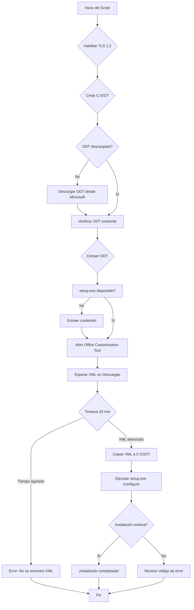
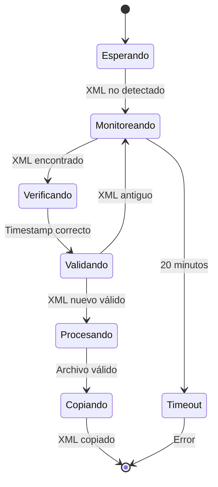
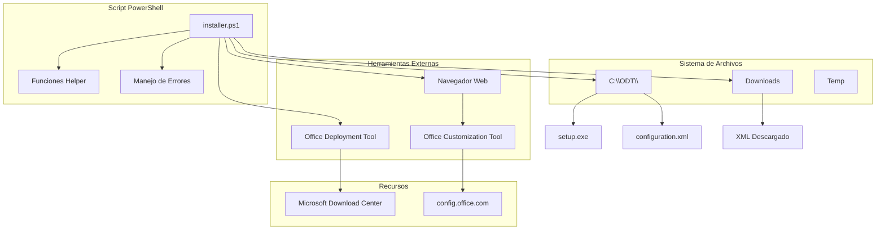
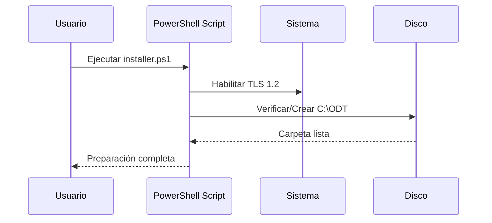
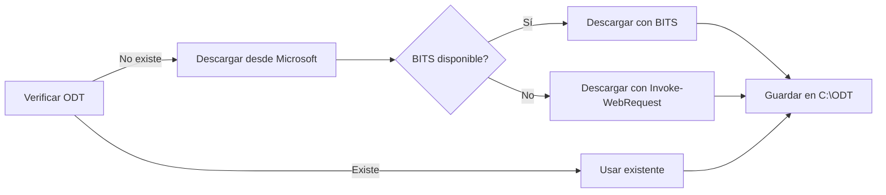
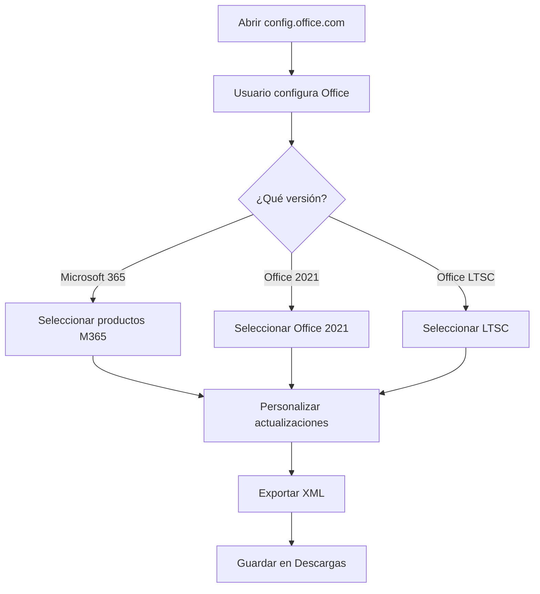
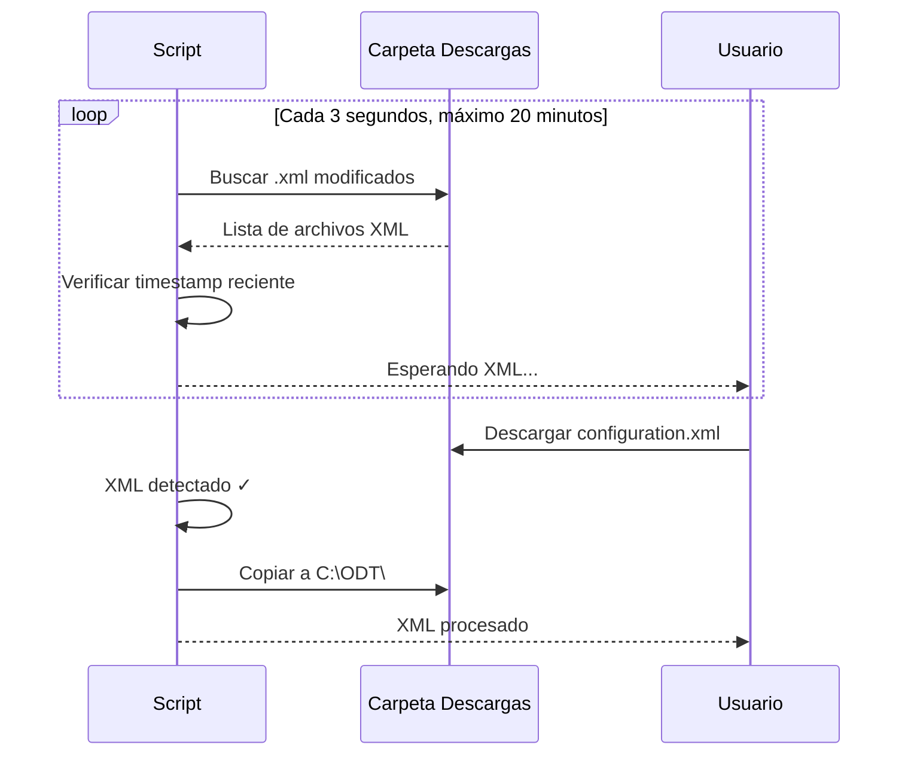
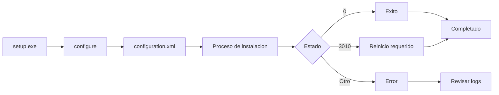
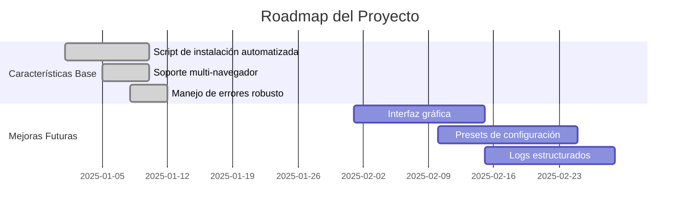

# 📦 Office Deployment Tool - Instalador Automatizado

> Script de PowerShell para automatizar la instalación de Microsoft Office utilizando el Office Deployment Tool (ODT) y la Office Customization Tool.

[](https://opensource.org/licenses/MIT)
[](https://docs.microsoft.com/powershell/)

---

## 📖 Tabla de Contenidos

- [Descripción General](#-descripción-general)
- [Características Principales](#-características-principales)
- [Arquitectura y Flujo](#-arquitectura-y-flujo)
- [Requisitos del Sistema](#-requisitos-del-sistema)
- [Instalación y Uso](#-instalación-y-uso)
- [Configuración Avanzada](#-configuración-avanzada)
- [Solución de Problemas](#-solución-de-problemas)
- [Contribuir](#-contribuir)
- [Licencia](#-licencia)

---

## 🎯 Descripción General

Este proyecto automatiza completamente el proceso de instalación de Microsoft Office mediante:

- **Office Deployment Tool (ODT)**: Herramienta oficial de Microsoft para la implementación de Office
- **Office Customization Tool**: Interfaz web para generar archivos de configuración XML personalizados
- **PowerShell**: Script automatizado que orquesta todo el proceso

### ¿Por qué usar este script?

✅ Elimina pasos manuales repetitivos  
✅ Reduce errores de configuración  
✅ Optimiza el tiempo de instalación  
✅ Garantiza instalaciones consistentes  
✅ Soporta múltiples navegadores automáticamente

---

## ✨ Características Principales

| Característica | Descripción |
|---|---|
| 📥 **Descarga Automática** | Obtiene el ODT directamente desde Microsoft |
| 📂 **Gestión de Archivos** | Organiza todo en `C:\ODT` de forma automática |
| 🌐 **Apertura Inteligente** | Abre el navegador en la herramienta de personalización |
| 📑 **Detección Automática** | Monitorea y detecta el XML en la carpeta de Descargas |
| ⚙️ **Ejecución Automatizada** | Ejecuta la instalación con los parámetros óptimos |
| 🔄 **Manejo de Errores** | Sistema robusto de reintentos y mensajes informativos |
| 🌍 **Multi-navegador** | Compatible con Edge y Chrome automáticamente |

---

## 🏗️ Arquitectura y Flujo

### Diagrama de Flujo General



### Diagrama de Estados del Monitoreo



### Diagrama de Componentes



---

## 📋 Requisitos del Sistema

### Requisitos Mínimos

| Componente | Especificación |
|------------|----------------|
| **Sistema Operativo** | Windows 10 (64-bit) o superior |
| **PowerShell** | Versión 5.1 o superior |
| **Conectividad** | Conexión a Internet estable |
| **Permisos** | Ejecutar como Administrador |
| **Espacio en Disco** | Mínimo 5 GB libres |
| **RAM** | Mínimo 2 GB |

### Verificar Versión de PowerShell

```powershell
$PSVersionTable.PSVersion
```

Ejemplo de salida esperada:
```
Major  Minor  Build  Revision
-----  -----  -----  --------
5      1      22621  2506
```

### Navegadores Soportados

El script detecta automáticamente estos navegadores:

- ✅ Microsoft Edge (x64)
- ✅ Microsoft Edge (x86)
- ✅ Google Chrome (Instalación estándar)
- ✅ Google Chrome (Perfil de usuario)

---

## 📦 Instalación y Uso

### Método 1: Instalación Rápida (Recomendado)

```powershell
irm https://raw.githubusercontent.com/4h1g4L0w4/Office-Deployment-Tool/refs/heads/main/installer.ps1 | iex
```

**Ventajas:**
- ✅ No requiere clonar el repositorio
- ✅ Siempre obtiene la última versión
- ✅ Ejecución directa desde la web

### Método 2: Instalación Local

**Paso 1: Clonar el Repositorio**

```powershell
git clone https://github.com/4h1g4L0w4/Office-Deployment-Tool.git
cd Office-Deployment-Tool
```

**Paso 2: Ejecutar el Script**

Abre PowerShell como **Administrador** y ejecuta:

```powershell
Set-ExecutionPolicy Bypass -Scope Process -Force
.\installer.ps1
```

---

## 🔧 Proceso Detallado Paso a Paso

### Fase 1: Preparación del Entorno



**Lo que ocurre:**
1. El script habilita TLS 1.2 para descargas seguras
2. Crea el directorio `C:\ODT` si no existe
3. Verifica el espacio en disco necesario

### Fase 2: Descarga del ODT



**Características:**
- URL oficial de Microsoft (versión 19029-20136)
- Reintento automático si falla BITS
- Tamaño aproximado: 10 MB
- Validación de integridad del archivo

### Fase 3: Extracción del ODT

```powershell
officedeploymenttool.exe /quiet /extract:C:\ODT
```

**Archivos extraídos:**
- `setup.exe` - Instalador principal
- `configuration.xml` (ejemplo)
- Documentación adicional

### Fase 4: Configuración de Office



**Opciones de configuración típicas:**

| Opción | Valores Comunes |
|--------|----------------|
| **Producto** | Microsoft 365, Office 2021, Office LTSC |
| **Aplicaciones** | Word, Excel, PowerPoint, Outlook, etc. |
| **Idiomas** | Español, Inglés, múltiples |
| **Canales de Actualización** | Monthly, Semi-Annual, Beta |
| **Licencia** | Activación por usuario, KMS, etc. |

### Fase 5: Detección del XML



**Características del monitoreo:**
- Intervalo de verificación: 3 segundos
- Timeout: 20 minutos
- Validación de timestamp
- Manejo de múltiples archivos XML

### Fase 6: Instalación



**Comandos ejecutados:**
```powershell
cd C:\ODT
.\setup.exe /configure configuration.xml
```

---

## ⚙️ Configuración Avanzada

### Variables del Script

Puedes personalizar el comportamiento modificando estas variables al inicio de `installer.ps1`:

```powershell
# Directorio de trabajo
$WorkDir = "C:\ODT"

# Tiempo máximo de espera para el XML (minutos)
$TimeoutMin = 20

# URL directa del ODT
$OdtDirectUrl = "https://download.microsoft.com/download/6c1eeb25-cf8b-41d9-8d0d-cc1dbc032140/officedeploymenttool_19029-20136.exe"

# Carpeta de descargas
$Downloads = Join-Path $env:USERPROFILE "Downloads"
```

### Personalizar Timeout

Si necesitas más tiempo para generar el XML:

```powershell
# Editar línea 7 en installer.ps1
$TimeoutMin = 30  # 30 minutos en lugar de 20
```

### Usar otro Directorio

```powershell
# Editar línea 6 en installer.ps1
$WorkDir = "D:\OfficeInstall"
```

### Agregar más Navegadores

```powershell
# Editar líneas 15-20 en installer.ps1
$Browsers = @(
  "$env:ProgramFiles(x86)\Microsoft\Edge\Application\msedge.exe",
  "$env:ProgramFiles\Microsoft\Edge\Application\msedge.exe",
  "$env:ProgramFiles\Google\Chrome\Application\chrome.exe",
  "$env:LOCALAPPDATA\Google\Chrome\Application\chrome.exe",
  "$env:ProgramFiles\Firefox\firefox.exe"  # ← Agregar Firefox
)
```

---

## 🐛 Solución de Problemas

### Problema 1: Script bloqueado por ExecutionPolicy

**Síntomas:**
```
PowerShell execution policy error
```

**Solución:**
```powershell
Set-ExecutionPolicy -ExecutionPolicy RemoteSigned -Scope CurrentUser
```

O ejecutar con bypass temporal:
```powershell
powershell.exe -ExecutionPolicy Bypass -File .\installer.ps1
```

### Problema 2: Error al descargar ODT

**Síntomas:**
```
BITS falló, probando con Invoke-WebRequest...
No se pudo descargar
```

**Soluciones:**

1. **Verificar conectividad:**
```powershell
Test-NetConnection download.microsoft.com -Port 443
```

2. **Descargar manualmente:**
   - Descargar ODT desde: https://www.microsoft.com/download
   - Guardarlo como `C:\ODT\officedeploymenttool.exe`
   - Re-ejecutar el script

3. **Configurar proxy (si aplica):**
```powershell
$env:https_proxy = "http://proxy:puerto"
```

### Problema 3: No se detecta el XML

**Síntomas:**
```
No encontré un XML nuevo en Descargas dentro de 20 minutos
```

**Soluciones:**

1. **Verificar que se descargó correctamente:**
```powershell
Get-ChildItem -Path $env:USERPROFILE\Downloads\*.xml | Select-Object Name, LastWriteTime
```

2. **Copiar manualmente:**
```powershell
Copy-Item "C:\Users\TuUsuario\Downloads\configuration.xml" -Destination "C:\ODT\configuration.xml" -Force
```

3. **Aumentar timeout:**
   - Editar `$TimeoutMin = 40` en el script

### Problema 4: Error en la instalación de Office

**Síntomas:**
```
Instalación finalizada con código [número]
```

**Códigos de error comunes:**

| Código | Significado | Solución |
|--------|-------------|----------|
| 0 | ✅ Éxito | - |
| 3010 | ⚠️ Requiere reinicio | Reiniciar el equipo |
| 1603 | ❌ Error fatal | Verificar XML y logs |
| 17004 | ❌ Producto no encontrado | Verificar ID de producto en XML |
| 30088 | ❌ Error de descarga | Verificar conectividad |

**Ver logs detallados:**
```powershell
Get-ChildItem -Path $env:TEMP -Filter "*OfficeSetup*" -Recurse | Sort-Object LastWriteTime -Descending | Select-Object -First 5
```

### Problema 5: El navegador no abre

**Síntomas:**
```
No se puede abrir config.office.com
```

**Solución manual:**
```powershell
Start-Process "https://config.office.com/deploymentsettings"
```

---

## 📊 Estado del Proyecto



---

## 🤝 Contribuir

Las contribuciones son bienvenidas. Por favor:

1. **Fork** el repositorio
2. Crea una **rama** para tu feature (`git checkout -b feature/AmazingFeature`)
3. **Commit** tus cambios (`git commit -m 'Add some AmazingFeature'`)
4. **Push** a la rama (`git push origin feature/AmazingFeature`)
5. Abre un **Pull Request**

### Áreas donde puedes ayudar

- 🌐 Traducción a más idiomas
- 🐛 Reporte de bugs
- 📝 Mejoras en documentación
- 🚀 Nuevas funcionalidades
- 🧪 Testing en diferentes entornos

---

## 📄 Licencia

Este proyecto está bajo la Licencia MIT. Ver archivo [LICENSE](LICENSE) para más detalles.

```
MIT License

Copyright (c) 2025 4h1g4L0w4

Permission is hereby granted, free of charge, to any person obtaining a copy
of this software and associated documentation files (the "Software"), to deal
in the Software without restriction, including without limitation the rights
to use, copy, modify, merge, publish, distribute, sublicense, and/or sell
copies of the Software, and to permit persons to whom the Software is
furnished to do so, subject to the following conditions:

The above copyright notice and this permission notice shall be included in all
copies or substantial portions of the Software.

THE SOFTWARE IS PROVIDED "AS IS", WITHOUT WARRANTY OF ANY KIND, EXPRESS OR
IMPLIED, INCLUDING BUT NOT LIMITED TO THE WARRANTIES OF MERCHANTABILITY,
FITNESS FOR A PARTICULAR PURPOSE AND NONINFRINGEMENT. IN NO EVENT SHALL THE
AUTHORS OR COPYRIGHT HOLDERS BE LIABLE FOR ANY CLAIM, DAMAGES OR OTHER
LIABILITY, WHETHER IN AN ACTION OF CONTRACT, TORT OR OTHERWISE, ARISING FROM,
OUT OF OR IN CONNECTION WITH THE SOFTWARE OR THE USE OR OTHER DEALINGS IN THE
SOFTWARE.
```

---

## 🙏 Agradecimientos

- Microsoft por proporcionar las herramientas oficiales ODT y OCT
- La comunidad de PowerShell por las mejores prácticas
- Todos los contribuidores del proyecto

---

## 📞 Soporte

- 🐛 **Reportar Bugs:** [Issues](https://github.com/4h1g4L0w4/Office-Deployment-Tool/issues)
- 💬 **Preguntas:** Abre una discusión en GitHub
- 📚 **Documentación:** Microsoft [Office Customization Tool](https://config.office.com)

---

<div align="center">

**⭐ Si este proyecto te fue útil, considera darle una estrella en GitHub ⭐**

Hecho con ❤️ por [4h1g4L0w4](https://github.com/4h1g4L0w4)

</div>
